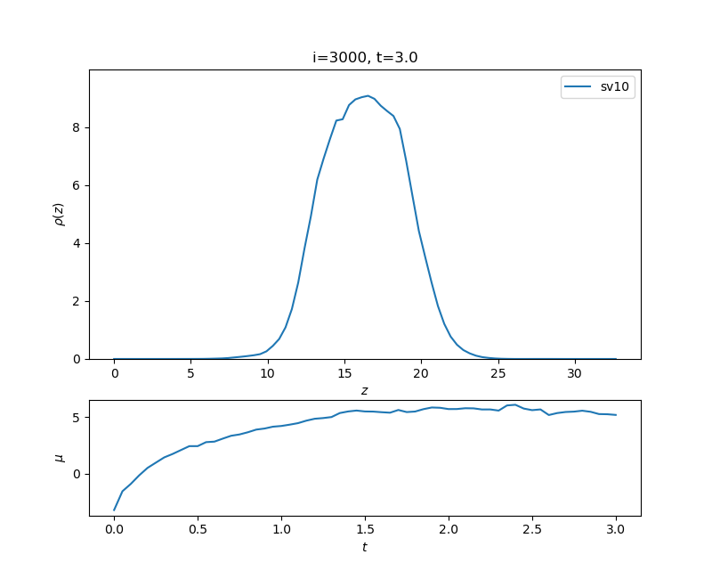

# biofts

The `biofts` package is Python package for field theoretic simulations (FTS) of polymer field theories through Complex-Langevin sampling written by Jonas Wessén. The code is applicable to a large class of polymer field theories but a particular goal of the package is simulations of liquid-liquid phase-separation of intrinsically disordered proteins (IDPs) and other processes relevant to biomolecular condensates.

## Background

If you are new to polymer field theories and FTS, the following references will provide a good starting point:

1. G. H. Fredrickson, V. Ganesan and F. Drolet, Field-Theoretic Computer Simulation Methods for Polymers and Complex Fluids, Macromolecules 2002, 35, 1, 16–39. <hlink>https://doi.org/10.1021/ma011515t</hlink>
2. V. Ganesan and G. H. Fredrickson, Field-theoretic polymer simulations, 2001 EPL 55 814. <hlink>https://doi.org/10.1209/epl/i2001-00353-8</hlink>
3. M. W. Matsen (2005). Self-Consistent Field Theory and Its Applications. In Soft Matter (eds G. Gompper and M. Schick). <hlink>https://doi.org/10.1002/9783527617050.ch2</hlink>

For the serious reader, the following book beautifully covers the topic:

4.  G. H. Fredrickson and K. T. Delaney. (2023). Field-Theoretic Simulations in Soft Matter and Quantum Fluids. Oxford University Press.

For an application of FTS to IDPs with both long-range electrostatic interactions and short-range residue-specific interactions, see:

5. J. Wessén, S. Das., T. Pal, H. S. Chan. Analytical Formulation and Field-Theoretic Simulation of Sequence-Specific Phase Separation of Protein-Like Heteropolymers with Short- and Long-Spatial-Range Interactions, J. Phys. Chem. B 2022, 126, 9222−9245, <hlink>https://doi.org/10.1021/acs.jpcb.2c06181</hlink>

## Overview

`biofts` can be used to study any polymer field theory described by a Hamiltonian on the form

$$
H[\lbrace\psi_a(\vec{r},t) \rbrace] = -\sum_{i=1}^{M_{\rm C}} n_i \ln Q_i[\lbrace \psi_a \rbrace] - \sum_{I=1}^{M_{\rm G}} z_I Q_I[\lbrace \psi_a \rbrace] + \int \mathrm{d}^d \vec{r} \frac{1}{2} \sum_{a} \psi_a(\vec{r}) \hat{V}_a^{-1} \psi_a(\vec{r}) 
$$

Here, $\psi_a(\vec{r},t)$ is a field that decouples interactions of type $a$, i.e. the index $a$ runs over all possible interactions in the system such as electrostatic interactions, excluded volume interactions, etc. The system contains $M_{\rm C}$ molecular species in the canonical ensemble (fixed number of molecules $n_i$) and $M_{\rm G}$ molecular species in the grand canonical ensemble (fixed activities $z_I$). The $Q_i$ and $Q_I$ are complex-valued single-molecule partition functions for the canonical and grand canonical species, respectively. The last term contains the inverse operators for the respective interaction potentials $V_a(r)$. [If this formalism is unfamiliar to you, please have a look at the references above.]

The key functionality of `biofts` is to evolve the fields $\psi_a(\vec{r})$ in Complex-Langevin time $t$ using the following stochastic differential equation:

$$
\frac{\partial \psi_a(\vec{r},t)}{\partial t} = -\frac{\delta H}{\delta \psi_a(\vec{r},t)} + \eta_a(\vec{r},t)
$$

where $\eta_a(\vec{r},t)$ is a real-valued Gaussian noise term. This is achieved by approximating the continuous fields $\psi_a(\vec{r},t)$ as a discrete set of field variables living on the sites of a $d$-dimensional rectangular lattice, and then evolving the fields in $t$ using a finite-difference scheme. The resulting field trajectories can then be used to compute thermodynamic averages of observables of interest. 

It is possible in `biofts` to set the noise term $\eta_a(\vec{r},t)$ to zero, in which case FTS reduces to self-consistent field theory (SCFT).

## Quick start

First, import the package along with any other packages you need:

```python
import biofts
import numpy as np
```

Setting up a simulation in `biofts` is done through the following steps:

### Step 1: Define the interactions

In FTS, each field corresponds to a a specific interaction in the system, so the first step is to define the interactions in the system. `biofts` currently supports Yukawa-type interactions, $V(r) = l \mbox{ } \mathrm{e}^{- \kappa r} / r $, and contact interactions, $V(r) = \gamma^{-1} \delta(r)$. These can be defined as follows:

```python

# Excluded volume contact interactions
v = 0.0068
excluded_volume = biofts.Contact(1./v)

# (Un-screened) Electrostatics
lB = 2.
kappa = 0.0
electrostatics = biofts.Yukawa(lB,kappa)

# Collect all interactions in a tuple
interactions = (excluded_volume,electrostatics)
```

You can define any number of interactions in this way.

### Step 2: Create the simulation box

A simulation box is created by specifying the number of lattice sites in each dimension, the lattice spacing, and the interactions in the system. For example,

```python

# Define the grid
grid_dimensions = [16,16,80] # Number of lattice sites in each dimension. This can be a 1D, 2D, or 3D grid.
side_lengths    = [8.,8.,40.] # Length of the simulation box in each dimension

# Create the simulation box
sb = biofts.SimulationBox(grid_dimensions,side_lengths,interactions)

```

If you have CUDA Python installed, you can use pass the argument `use_GPU=True` to the `SimulationBox` constructor to use the GPU to speed up the Complex-Langevin sampling.

### Step 3: Add the molecular species to the simulation box

Currently, `biofts` currently only supports linear bead-spring polymers where each monomer is associated with a set of generalized charges that governs its interactions with other monomers through the interactions defined in Step 1. For applications to IDPs, each monomer typically represents a residue in the protein sequence. 

The single-molecule partition function for such a polymer species with $N$ monomers, with positions $\vec{R}_{\alpha}$, is given by

$$
Q[\lbrace \psi_a \rbrace ] = \frac{1}{V} \left( \frac{3}{2 \pi b^2} \right)^{\frac{3(N-1)}{2}} \left( \prod_{\alpha=1}^N \int \mathrm{d} \vec{R}_\alpha \right) \mathrm{e}^{ - \frac{3}{2 b^2} \sum \Delta R^2 - \mathrm{i} q \cdot \psi}
$$

where $b$ is the Kuhn length, $V$ is the volume of the simulation box, $\Delta R$ is the displacement between neighboring monomers along the chain and

$$
q \cdot \psi \equiv \sum_{a,\alpha} q_{a,\alpha} \int \mathrm{d} \vec{r} \Gamma(\vec{R}_{\alpha} - \vec{r}) \psi_a(\vec{r})
$$

Here, $\Gamma(\vec{r})$ is a Gaussian distribution which regulates ultraviolet divergences arising from contact interactions and self-energies. The quantity $q_{a,\alpha}$ is the generalized charge for the interaction type $a$ on monomer $\alpha$.

The following code snippet shows how to add a single polymer species, corresponding to a linear chain of E (glutamic acid) and K (lysine) residues:

```python

aa_sequence = 'EKKKKKKEEKKKEEEEEKKKEEEKKKEKKEEKEKEEKEKKEKKEEKEEEE' # Amino-acid sequence
mol_id = 'sv10' # Name of the polymer species
N = len(seq) # Number of monomers in the chain

q = np.zeros( (2,N) ) # Generalized charges. The first index refers to interaction type, the second to monomer index.

# Excluded volume interactions
q[0,:] += 1. # The generalized charge for the excluded volume interaction is the monomer size, set to 1 for all monomers.

# Electrostatic interactions
aa_charges = {'E':-1,'K':1} # Electric charges for each amino acid type
q[1,:] = [ charge_seq[aa] for aa in aa_sequence ]

# Chain density
rho_bulk = 2.0 / N # rho_bulk is chain number density, n/V. Bead number density is n*N/V.

# Create the polymer species
a = 1./np.sqrt(6.) # Gaussian smearing length
b = 1. # Kuhn length
biofts.LinearPolymer(q,a,b,rho_bulk,sb,molecule_id=seq_label)

```

You can add any number of polymer species to the simulation box in this way. Note that variants of the $N=1$ `LinearPolymer` object can be used to represent explicit salt ions and solvent particles. 

For species in the grand canonical ensemble, you can supply the argument `is_canonical=False` to the `LinearPolymer` constructor. In this case, the `rho_bulk` argument is interpreted as the activity of the species (i.e. the exponential of the chemical potential).


### Step 4: Run the simulation

To run the simulation, we first need to create a `ComplexLangevin` object which takes as input the time step `dt`, the simulation box `sb`, and the integration method. For example:
```python
# Set-up the CL integrator
dt = 1e-3
cl = biofts.ComplexLangevinIntegrator(dt, sb)
```

For self-consistent field theory (SCFT), you can set the noise to zero by passing the additional argument `noise=0` to the `ComplexLangevinIntegrator` constructor.

The `cl` object has a method `run_ComplexLangevin(n_steps)` which evolves the fields in the simulation box for `n_steps` time steps using a semi-implicit integration scheme. This method can also takes two optional arguments `sample_interval` and `sampling_tasks`. The `sampling_tasks` argument is a tuple of functions that are called evert `sample_interval` steps to e.g. compute and store observables. `biofts` provides a number of built-in sampling tasks that can be used for this purpose. For example, the `Monitor_Density_Profiles_Averaged_to_1d` creates a `matplotlib` figure that visualizes the average monomer densities (for all molecule species in the system) along the last axis of the simulation box in real time. The figure is updated every `sample_interval` steps. The following code snippet shows how to set up this task:

```python

# Set-up visualization task
visualizer = biofts.Monitor_Density_Profiles_Averaged_to_1d(sb)

 ### Run the simulation ####
n_steps = 10000
sample_interval = 50
cl.run_ComplexLangevin(n_steps, sample_interval=sample_interval, sampling_tasks=(visualizer,))
```

This will show a figure that looks like this:

The top row shows the real part of the monomer density operator and the bottom row shows the time-evolution of the chemical potential. 


### Sampling tasks
`biofts` currently provides the following built-in sampling tasks which can be created for a given `simulation_box` object:

1. `Monitor_Density_Profiles_Averaged_to_1d(simulation_box, species_to_plot=None, show_imaginary_part=False, pause_at_end=True)`: Monitors the average monomer densities along the last axis of the simulation box in real time.  The optional argument `species_to_plot` is a list of integers representing the molecular species to be shown, e.g. `species_to_plot=[0,1,3]` means that the first, second and fourth species that were added to `simulation_box` will be show (if `None`, all species are plotted). If `show_imaginary_part=True`, the imaginary part of the density operator is also plotted as dashed curves. If `pause_at_end=True`, the simulation pauses at the end of the run until the user closes the figure.
2. `Save_Latest_Density_Profiles(simulation_box, data_directory='')`: Saves the density operators to a file `data_directory + 'density_profiles.npz`. The file is overwritten every time the task is called. You can load the densities as `rho = np.load(data_directory + 'density_profiles.npz')` where `rho[i]` will be the density operator for the $i$th species. 
3. `Save_1d_Density_Profiles(simulation_box, data_directory='', species_to_plot=None, remove_old_data_files=False)`: This creates one file per species, `data_directory + 'density_profile_(mol id).txt'`, (where `mol id` is the name of the species). At every sampling point, a new line will be appended to the files where the first column is the current Complex-Langevin time, the second column is the step number, the third column is the real part of the chemical potential, and the remaining columns are the real part of the density operator averaged along the last axis of the simulation box. If `species_to_plot` is not `None`, only the species with indices in integer list `species_to_plot` will be saved. If `remove_old_data_files=True`, the old data files will be removed before the new data is saved.
4. `Save_Field_Configuration(simulation_box, data_directory='', load_last_configuration=True)`: Saves the current field configuration to a file `data_directory + 'field_configuration.npy'`. If `load_last_configuration=True`, the task will load the last saved field configuration at the beginning of the simulation. This can be useful for restarting a simulation from a previous state.

However, you will likely want to create your own sampling tasks to analyze the data and store the results relevant to your specific research question. To do this, you can use the following template class:

```python
class MySamplingTask:
    def __init__(self, simulation_box, ...):
        self.sb = simulation_box
        # Initialize any variables you need here

    def sample(self, sample_index):
        # This method is called every time the task is sampled
        # Compute and store any observables you need here
        pass

    def finalize(self):
        # This method is called at the end of the simulation
        pass

```

The current field configuration is retrieved from the `simulation_box` object as `self.sb.Psi` which is an `(n_fields, *grid_dimensions)` array. You can also retrieve the current number density operators as `self.sb.species[i].rhob` and the generalized charge-density operators as `self.sb.species[i].rho` where `i` is the index of the species in the simulation box. The `self.sb.species[i].rho` is an `(n_fields, *grid_dimensions)` array.

To use your sampling task, simply pass add it to the tuple of sampling tasks in the `sampling_tasks` argument of the `run_ComplexLangevin` method as shown above.